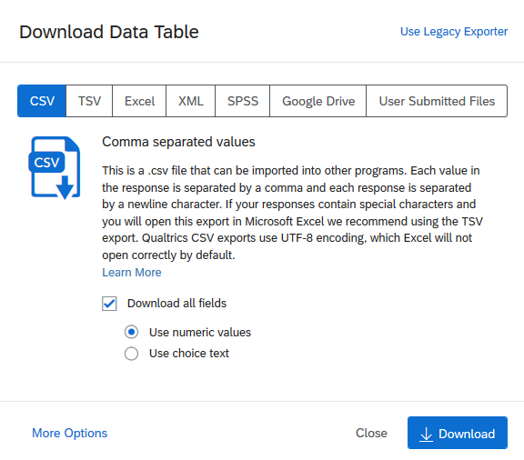

EMOCEMP
================

Instalação do emocempr Package
^^^^^^^^^^^^^^^^^^^^^^^^^^^^^^
No seu console de R faça o seguinte:

.. code-block:: R

    packages <- c("data.table","irr","dplyr","stringr","lubridate")
    for (i in packages){
        if(!require(i)){
                install.packages(i)
        }
    } 
    if (!require("devtools")){
        install.packages("devtools")}
        
    devtools::install_github("rafaelsommer1/emocempr")

Esse bloco instalará todas as dependências bem como a última versão do emocempr packages

Adquirindo os dados
^^^^^^^^^^^^^^^^^^^
As funções do pacote trabalham basicamente com o output cru do banco de dados do qualtrics

É necessário realizar o download do .csv em sua forma númerica, da visita de interesse

Funções do Package
^^^^^^^^^^^^^^^^^^
As principais funções implementadas até o momento focam
a manipulação e limpeza dos dados retirados do qualtrics.

Até o momento é possível limpar todos os dados das visitas 1,2 e 3 com:

.. code-block:: r

    clean_v1(file.csv, exclude = TRUE, autoantibodies = file.csv)
    clean_v2(file.csv)
    clean_v3(file.csv)

Em que:

- *file.csv* é o arquivo baixado do qualtrics
- *exclude* se = TRUE, excluí os pacientes excluidos do estudo
- *autoantibodies* pode-se incluir o csv com os dados de anticorpos para fusionar com o banco original
