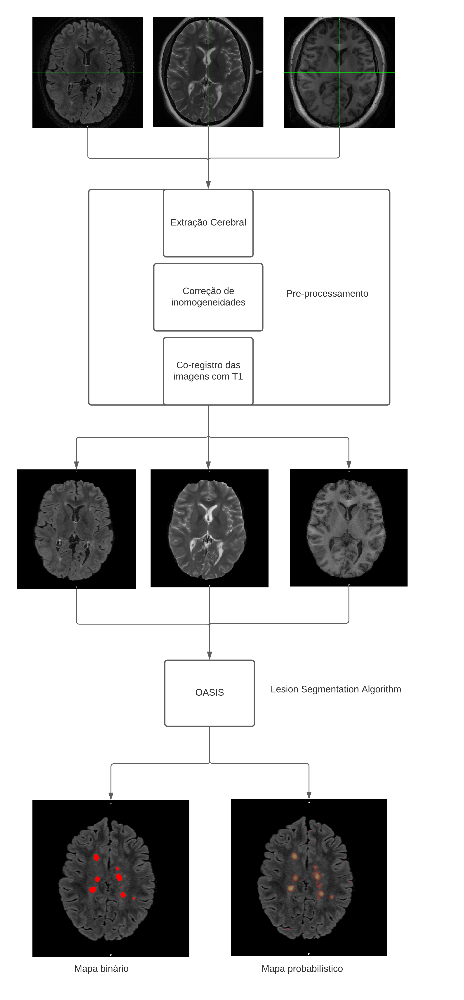
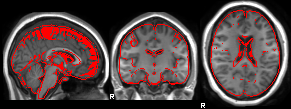
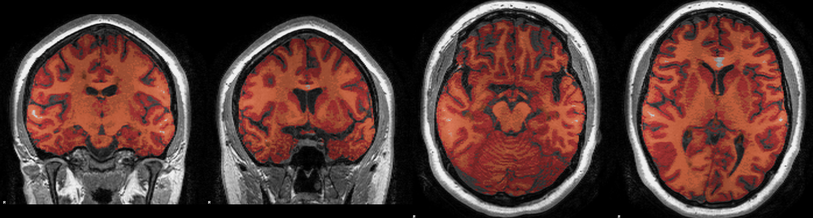
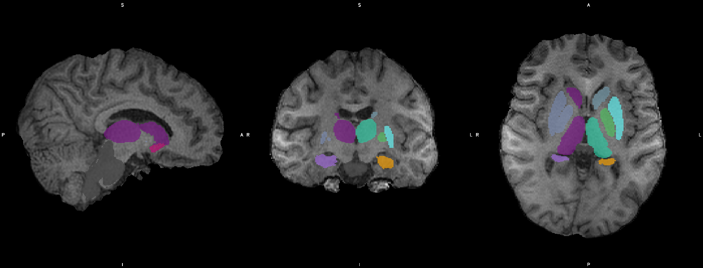

Processamento de imagens anatômicas
===================================

Objetivos
^^^^^^^^^

Este tópico se destina ao processamento de imagens anatômicas de pacientes com esclerose múltipla ou outras patologias desmielinizantes. Ao final do protocolo nosso objetivo é obter os seguintes dados:

- Mapa de lesões (probabilístico e binário)
- Mascaras de substância branca, substância cinzenta e LCR
- Volumetria normalizada de cérebro total, substância branca e substância cinzenta
- Volumetrias subcorticais normalizadas e absolutas
- Mapas corticais de volume, área e espessura com parcelações

Mapa de lesões
^^^^^^^^^^^^^^
Inicialmente, costumo utilizar um script em R que realiza os seguintes procedimentos:

1. Extração de calota craniana
2. Normalização de sinal
3. Cálculo de mapas lesionais

Para chamar este script, necessitamos de pelo menos:

- Um T1 volumétrico (t1.nii.gz)
- Um Flair volumétrico (flair.nii.gz)
- Um T2 (t2.nii.gz)

De dentro de uma pasta com os 3 arquivos chame:

.. code-block:: bash

    lesionMap t1.nii.gz t2.nii.gz flair.nii.gz

O processamento do script segue o seguinte algoritmo:

É importante que a segmentação das lesões seja o primeiro passo do nosso fluxo, 
porque além de já realizar algumas funções com nosso T1, 
o mapa de lesões será utilizado em funções posteriores, como as volumetrias

O script de R que é chamado pelo comando **lesionMap** pode ser
visualizado em https://github.com/rafaelsommer1/neuroimage/blob/master/R/lesionMap.R,
caso seu mapa não fique adequado, é possível customizar os parâmetros do script

Volumetrias com SIENAX e FIRST
^^^^^^^^^^^^^^^^^^^^^^^^^^^^^^

Para cálculo de volume de substância branca e cinzenta costumo utilizar o SIENAX, visto que o mesmo
nos proporciona tanto os resultados normalizados quanto os valores absolutos,
e se trata de um algoritmo relativamente rápido e acurado de segmentação.

.. [SIENAX] S.M. Smith, Y. Zhang, M. Jenkinson, J. Chen, P.M. Matthews, A. Federico, and N. De Stefano. Accurate, robust and automated longitudinal and cross-sectional brain change analysis. NeuroImage, 17(1):479-489, 2002. 
   

Para o SIENAX precisaremos do nosso T1 volumétrico e um mapa binário de lesão que é utilizado para 
preencher a substância branca evitando a subestimação dos volumes.

O comando é simples

.. code:: bash
    
    sienax t1.nii.gz \
      -B "-f 0.25 -B" \
      -lm binmask.nii.gz

Os arquivos resultantes se encontrarão em uma pasta *t1_sienax* 
a pasta resultante terá os seguintes arquivos:

- report.html = arquivo com os resultados
- report.sienax = arquivo com os resultados em texto
- t12std.mat = matrix utilizada para normalização do cérebro

Ao abrir o arquivo *report.html* um relatório deve ser aberto no seu browser
contendo imagens para correção de qualidade da extração cerebral, registro e segmentação
e os resultados volumétricos em mm3 e o valor de escalonamento que podera ser utilizado
no FIRST a seguir

Exemplos de imagens contidas em report.html

Exemplo de report.sienax

.. code:: md
    

    SIENA - Structural Image Evaluation, using Normalisation, of Atrophy
    part of FSL www.fmrib.ox.ac.uk/fsl
    running cross-sectional atrophy measurement: sienax version 2.6
    sienax 

    ----------  extract brain  --------------------------------------------

    ----------  register to standard space using brain and skull  --------
    (do not worry about histogram warnings)
    VSCALING 1.5979280678

    ----------  mask with std mask  ---------------------------------------

    ----------  segment tissue into types  --------------------------------

    ----------  convert brain volume into normalised volume  --------------

    tissue             volume    unnormalised-volume
    GREY               859547.67 537913.87
    WHITE              779114.57 487578.00
    BRAIN              1638662.24 1025491.87

Após obter os valores de volumetria dos tecidos cerebrais de forma geral,
realizaremos a segmentação das estruturas subcorticais desses pacientes com FIRST
no pacote criado pelo nosso grupo, podemos utilizar um script que padroniza a análise:

.. [FIRST] Patenaude, B., Smith, S.M., Kennedy, D., and Jenkinson M. A Bayesian Model of Shape and Appearance for Subcortical Brain NeuroImage, 56(3):907-922, 2011.

.. code:: bash
    
    $ mkdir first_results
    $ run_first_all -i t1.nii.gz -o first_results/results
    $ cd first_results
    $ firstSeg results_all_fast_firstseg

Por fins de reprodutibilidade sugiro sempre realizar o chamado desta forma.
esse bloco de código faz o seguinte

1. Cria uma pasta para armazenar os resultados
2. Chama FIRST para realizar a segmentação no arquivo de T1
3. Troca para o diretório dos resultados
4. Chama o script personalizado para gerar um arquivo com os resultados volumétricos

O resultado é uma pasta com as imagens segmentadas, e um arquivo de texto
*firstSeg.txt* que contém algo nesse sentido:

.. code:: text

    27139 5964.219717 	Left-Thalamus-Proper
    14744 3240.224603 	Left-Caudate
    19081 4193.348186 	Left-Putamen
    6018 1322.549624 	Left-Pallidum
    58330 12818.929808 	Brain-Stem
    11958 2627.957529 	Left-Hippocampus
    4332 952.024755 	Left-Amygdala
    1856 407.885029 	Left-Accumbens-area
    24642 5415.464912 	Right-Thalamus-Proper
    9711 2134.144135 	Right-Caudate
    20585 4523.875709 	Right-Putamen
    6652 1461.881040 	Right-Pallidum
    13055 2869.040436 	Right-Hippocampus
    4068 894.006625 	Right-Amygdala
    2426 533.151444 	Right-Accumbens-area

Aqui a primeira coluna se refere ao número de voxels do ROI, a segunda ao volume
em mm3 e a terceira a estrutura do ROI

Estes resultados, porém, se referem aos volumes não-normalizados. Para normalizá-los 
basta multiplicar o volume pelo **VSCALLING** obtido no SIENAX  

Sempre fica recomendado, também, checar a qualidade da segmentação visualizando as imagens
Neste exemplo, podemos fazer isso com o seguinte comando:

.. code:: bash
    
    $ cd ..
    $ fsleyes t1.nii.gz first_results/results_all_fast_firstseg.nii.gz -cm subcortical 

Esse comando abrirá o visualizador com algo parecido com isso:

SIENA para volumes longitudinais
^^^^^^^^^^^^^^^^^^^^^^^^^^^^^^^^

Uma opção interessante caso o interesse seja a evolução do volume cerebral 
total ao longo do tempo é a utilização do SIENA. 
Aqui utilizamos um algoritimo para estimar a mudança de volume cerebral entre dois
pontos temporais, utilizando um registro meio-a-meio e estimando a média do deslocamento
dos bordos cerebrais, portanto, sem diferenciação no tipo de tecido.
Uma descrição detalhada pode ser encontrada em:

.. [SIENA] S.M. Smith, N. De Stefano, M. Jenkinson, and P.M. Matthews. Normalised accurate measurement of longitudinal brain change. Journal of Computer Assisted Tomography, 25(3):466-475, May/June 2001. 

A implementação é tão simples que pode ser realizada com uma linha:

.. code::

    siena t1_time1 t1_time2 -B "BET OPTIONS" -o output_folder

Para imagens adquiridas no INSCER, tenho obtido bons resultados com -B "-f 0.25 -B"
mas isto pode ser alterado conforme sua preferência e a manipulação de **bet** (https://fsl.fmrib.ox.ac.uk/fsl/fslwiki/BET/UserGuide)

Freesurfer
^^^^^^^^^^

Ainda sobre opções de processamento de imagens estruturais volumétrics, um dos algoritmos mais completos
para estimação tanto de volumes quanto medidas de superfície é **recon-all -all** do Freesurfer
A personalização de parâmetros aqui é ampla e pode ser revisada em: https://surfer.nmr.mgh.harvard.edu/fswiki/recon-all
Existe um script dentro dos comandos criados para o grupo que possui uma configuração padrão
que tem produzido resultados agradáveis com imagens adquiridas na GE do INSCER.

Para chamá-lo basta usar o seguinte comando, de dentro da pasta com seu arquivo anatômico

.. code::

   freesurferIndv t1.nii.gz

Esse comando provavelmente é o que consome mais tempo de todos os descritos nesse seguinte
e realiza as seguintes operações:

1. Todos os passo de recon-all -all 
2. Transformações com qcache
3. Subsegmentação de hipocampo e tronco encefálico

Já fornecendo todos os arquivos necessários para análise de grupos.
Contudo, o algoritimo do Freesurfer, invariavelmente necessita de correções 
manuais posteriores em alguns pontos específicos

